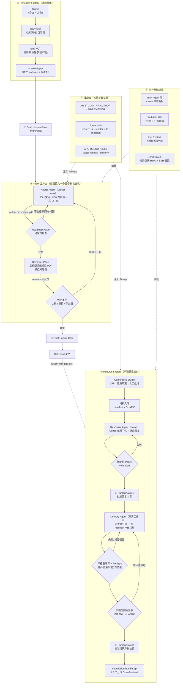

# Loom Auto Research System — 设计文档

> 一句话定位：**用确定性的 Python 状态机驾驭一群 LLM Agent，从"选题 → 做实验 → 写论文 →
> 多模型评审 → 修改迭代 → 交付"以及"收到审稿意见 → 写 rebuttal → 修订终稿"全流程自动化，
> 人只在少数关键 Gate 上做决策。**

---

## 0. 总图


```mermaid
flowchart TB
    subgraph RF["① Research Factory（选题孵化）"]
        direction LR
        ST["Studio<br/>（会议 × 方向）"] --> MINE["arXiv 挖掘<br/>检索词+类目可调"]
        MINE --> IDEA["Idea 卡片<br/>假设/新颖性/实验/风险"]
        IDEA --> SPAWN["Spawn Paper<br/>（独立 worktree + 状态机）"]
    end

    subgraph LOOP["② Paper 工作台（每篇论文一个回合制状态机）"]
        direction TB
        AUTHOR["Author Agent（Cursor, tmux）<br/>SSH 空闲 H100 做实验 + 写 LaTeX"]
        READY{"Readiness Gate<br/>确定性检查"}
        PANEL["Reviewer Panel<br/>三模型读编译后 PDF<br/>最低分定档"]
        STOP{"停止条件<br/>达标 / 满轮 / 平台期"}
        AUTHOR -->|"author.md + main.pdf"| READY
        READY -->|"不合格,列清单打回"| AUTHOR
        READY -->|"合格"| PANEL
        PANEL -->|"review.md 反馈"| STOP
        STOP -->|"继续下一轮"| AUTHOR
    end

    subgraph RB["③ Rebuttal Factory（审稿意见应对）"]
        direction TB
        CS["Conference Studio<br/>CFP→政策草案→人工批准"]
        IMP["材料入库<br/>manifest + SHA256"]
        RA["Response Agent（tmux）<br/>Concern 原子化 + 逐点回复"]
        VAL{"确定性 Policy<br/>Validation"}
        G1["🧑 Human Gate 1<br/>批准回复内容"]
        DA["Delivery Agent（隔离工作区）<br/>同步修订稿+一页 rebuttal+补充材料"]
        PRE{"严格重编译 + Preflight<br/>满页/匿名/页数/占位值"}
        FV{"三模型图片验收<br/>全票通过, SHA 绑定"}
        G2["🧑 Human Gate 2<br/>批准精确产物哈希"]
        BD["submission-bundle.zip<br/>（人工上传 OpenReview）"]
        CS --> IMP --> RA --> VAL --> G1 --> DA --> PRE --> FV --> G2 --> BD
        VAL -->|"失败"| RA
        PRE -->|"失败, 报告喂回"| DA
        FV -->|"有一票不过"| DA
    end

    subgraph SK["④ 技能库（方法论即文件）"]
        direction LR
        SK1["AR-STUDIO / AR-AUTHOR / AR-REVIEWER"]
        SK2["figure skills<br/>teaser 1–4 · results 1–2 · checkbib"]
        SK3["GPU-RESOURCES / paper-rebuttal / delivery"]
    end

    subgraph INFRA["⑤ 执行基础设施"]
        direction LR
        I1["tmux Agent 池<br/>+ Web 实时面板"]
        I2["Web UI / API<br/>:8766 + 公网隧道"]
        I3["Hot Restart<br/>不断任务换代码"]
        I4["GPU Scout<br/>轮询空闲 H100 + SSH 直跑"]
    end

    SPAWN --> DG["🧑 Draft Human Gate<br/>批准骨架稿"] --> LOOP
    STOP -->|"触发"| FG["🧑 Final Human Gate"] --> DONE["Delivered 论文"]
    DONE -.->|"投稿后收到审稿意见"| RB
    SK -.->|"注入 Prompt"| LOOP
    SK -.->|"注入 Prompt"| RB
    INFRA -.->|"承载"| LOOP
    INFRA -.->|"承载"| RB
```

---

## 1. 三条设计原则

1. **确定性与创造性分离。** 所有"流程决策"（何时评审、何时打回、何时停、允许谁批准什么）都由
   Python 状态机做，落盘为 JSON 状态；所有"内容创造"（实验、写作、画图、回复审稿人）都交给
   LLM Agent。模型的输出永远要经过代码的确定性校验才能推进状态。
2. **一切产物落盘、哈希绑定、可审计。** 每一轮的作者笔记、评审报告、readiness 报告都是磁盘文件；
   人工批准绑定的是**内容摘要/PDF 的 SHA-256**，而不是"当时看到的样子"——批准后任何改动都会让
   批准自动失效并要求重跑。
3. **分层门禁，人只守关键关口。** 便宜的确定性检查最先跑，昂贵的多模型评审其次，人工批准只出现
   在四个地方：论文骨架（Draft Gate）、论文定稿（Final Gate）、rebuttal 内容（Gate 1）、
   最终提交产物（Gate 2）。系统从不自动向会议系统投稿。

---

## 2. 模块一：Research Factory（选题孵化）

| 要素 | 说明 |
|---|---|
| Studio | 一个"会议 × 研究方向"的容器（如 `wacv3` × multimodal），持有检索设置与 idea 池 |
| arXiv 挖掘 | 按可编辑的检索词 + 类目抓论文；检索设置可让模型先"建议"，人再改 |
| Idea 卡片 | 每个 idea 结构化为：标题 / 可证伪假设 / 新颖性论证（与哪些论文什么关系：ports、extends、contradicts…）/ 主指标 / 实验清单 / 主要风险 / 评分 |
| Spawn | 选中的 idea 一键孵化为独立 Paper 任务：专属 git worktree（`work/code` + `work/manuscript`）、专属 tmux Author Agent、专属 `ar.json` 状态机 |

**讲解要点**：选题不是模型拍脑袋——idea 必须声明它和已有文献的关系，评分低的进不了孵化。

## 3. 模块二：Paper 工作台（AR Loop，核心状态机）

状态：`draft → await_draft_review →（🧑）→ loop →（触发条件）→ await_final_review →（🧑）→ delivered`

每一轮（round N）内部的固定节拍：

1. **Author Agent**（Cursor Agent，当前默认 `gpt-5.6-sol-max-fast`，常驻 tmux，
   工作在自己的 worktree）收到本轮 Prompt：
   上一轮的评审报告 + 方法论技能（AR-AUTHOR）+ 图片技能菜单 + GPU 集群使用规范。
   它做实验（读取 GPU Scout 后直接 SSH 到空闲 H100）、改论文、重编译，
   最后写 `author.md` 作为完成信号。
2. **Readiness Gate（确定性代码）**：编译必须干净；不允许任何 `\ARnum`/TODO/`??` 占位；
   各章节实质完整；page-one 总览图必须存在；所有被引用的图文件存在；引用无悬空。
   不合格 → 列出失败清单原样打回 Author，本轮重做，不消耗评审。
3. **Reviewer Panel（三模型）**：`gpt-5.6-sol-max-fast` + `claude-fable-5-thinking-max` +
   `kimi-k3-max` 并行、独立地**只读编译后的 PDF**（隔离临时目录，看不到源码
   和作者笔记，模拟真实审稿）。产出结构化分数（soundness/presentation/contribution/rating），
   **取最低分作为本轮定论**（防止单模型放水）。
4. **停止判定（代码）**：rating 达到 `stop_rating`（默认 8）/ 跑满 `max_rounds`（默认 10）/
   连续多轮无提升（plateau）→ 进入 Final Human Gate；否则携带评审意见进入下一轮。

**讲解要点**：作者与评审是**不同厂商的模型**、物理隔离；评审看到的和人类审稿人看到的完全一样——
一份 PDF，仅此而已。

## 4. 模块三：技能库（方法论即文件）

技能是 Markdown 文件，按角色注入 Prompt——改一个文件就升级所有 Agent 的工作方式，无需改代码：

- `AR-STUDIO.md` / `AR-AUTHOR.md` / `AR-REVIEWER.md`：三种角色的完整方法论；
- `figures/teaser-figure-1..4`、`results-figure-1..2`、`checkbib`：画图与查引用的具体做法
  （从纯代码矢量图到 AI 生成再到混合方案，多风格可选，作者按需取用）;
- `GPU-RESOURCES.md`：集群使用规范（禁止登录节点跑模型；读取 GPU Scout 的实时空闲清单，
  直接 SSH 到 compute node 并用 `CUDA_VISIBLE_DEVICES` 启动作业）;
- `paper-rebuttal/SKILL.md`、`paper-rebuttal-delivery/SKILL.md`：rebuttal 起草与终稿交付的方法论。

## 5. 模块四：Rebuttal Factory（两级结构 + 双人工 Gate）

**层级**：Conference Studio（一个会议一份政策）→ 该会议下多篇 Paper Rebuttal（继承政策）。

1. **政策发现**：给 Studio 一个 CFP/作者指南 URL → 模型抽取结构化政策（字数上限、是否允许修订稿、
   匿名要求、截止时间…）→ **人工审定**后冻结（Studio 状态机：`policy_input → policy_draft →
   await_policy_review → active`）。
2. **材料入库**：扫描论文包（原稿 PDF、审稿 PDF、代码与证据），生成带 SHA-256 的 manifest。
3. **Response Agent**（tmux 实时面板可看）：把 meta-review 与每位 reviewer 的意见**原子化**成
   concern 矩阵（ID/严重度/需要什么证据），再起草逐点回复——立场是 acceptance-first、
   evidence-bounded：只承诺已有证据支持的内容。
4. **确定性 Validation**：字符上限、concern 全覆盖、无占位符、无外链/邮箱、冻结稿件表述规则等。
   通过才允许 **🧑 Gate 1（内容批准）**，批准绑定回复文本哈希。
5. **Delivery Agent**（隔离 attempt 工作区，输入冻结摘要）：同步修订稿源码、把回复压成官方模板
   一页 rebuttal（彩色复述句 + 编号证据）、维护单独 supplement、写 revision-map（每个 concern
   落到哪一页哪一节）。
6. **严格重编译 + Preflight（代码）**：Loom 丢弃 Agent 的编译结果自己重建（latexmk/tectonic/
   pdflatex 三重后备，日志必须干净）；检查一页 rebuttal 恰好一页、US Letter、匿名、无外链、
   无占位值、WACV track/Paper ID 正确、**正文必须写满全部 8 页（References 只能从第 9 页开始）**、
   文件大小限制、revision-map 覆盖全部 concern。
7. **三模型图片验收**：同一评审面板逐图审查渲染质量（溢出/重叠/变形），**必须全票通过**，
   验收结果绑定当前 PDF 的 SHA——换 PDF 自动作废重验。
8. **🧑 Gate 2（最终产物批准）**：人批准的是精确文件哈希 → 确定性 zip 生成
   `submission-bundle.zip`。**上传 OpenReview 永远是人工操作。**

任何一步失败，报告会自动喂回对应 Agent 的 tmux 会话迭代（上限 6 轮），全程无人值守。

## 6. 模块五：执行基础设施

- **tmux Agent 池**：每个 Agent 一个命名会话，Web UI 内嵌实时面板，人随时可以视察或直接插话；
- **Web 层**（`web.py`，端口 8766 + 公网隧道）：三个入口——任务台 `/`、`/factory`、
  `/rebuttal-factory`；所有动作既有按钮也有 API；
- **Hot Restart**：换代码不换进程环境——保留公网 URL、鉴权 token、全部任务状态，正在写论文的
  Agent 无感知；
- **监控循环**：`delivery_monitor.py` 等看门狗把"Agent 完成 → 校验 → 验收 → 喂回失败报告"的
  节拍自动化，出结果或卡死才通知人；
- **GPU Scout + H100 集群**：守护进程每分钟 SSH 各 compute node 读取真实
  `nvidia-smi`，发布空闲 `node:gpu` 清单；Agent 不走不可靠的 Slurm 排队，
  而是二次确认显存后直接 SSH 启动作业。登录节点只做聚合和画图。

---

## 7. 一篇论文的完整生命周期（示例时间线）

```text
Studio 建立 → arXiv 挖掘 → idea 评分入池 → 人选中孵化
→ Round 0: Author 写骨架（全部数字留 \ARnum 占位）→ 🧑 Draft Gate
→ Round 1..N: 做实验(GPU) → 写作 → Readiness → 三模型评审(读PDF) → 按最低分意见修改
→ 评分达标 / 满轮 / 平台期 → 🧑 Final Gate → Delivered
→（投稿后收到审稿意见）→ Rebuttal Factory: 政策 → 逐点回复 → 🧑 内容批准
→ Delivery Agent 终稿 → Preflight + 图片验收 → 🧑 产物批准 → bundle → 人工上传
```

## 8. 防错分层：什么错误在哪一层被拦截

| 错误类型 | 拦截层 |
|---|---|
| 论文没写完就送审（占位符、缺图、编译警告） | Readiness Gate（确定性，免费） |
| 科学质量不足、论证薄弱 | 三模型评审面板（最低分定档） |
| 图变形 / 文字溢出 / 图例重叠 | 三模型图片验收（全票制，SHA 绑定） |
| 正文没写满页数上限 / rebuttal 超一页 | Delivery Preflight（确定性） |
| 表格里出现 "unmeasured" 等占位值 | Agent 指令模板明令禁止 + Preflight 正则 |
| 批准后偷偷改文件 | 哈希绑定：source/内容/产物任一变化 → 批准失效 |
| 回复承诺了做不到的实验 | Validation 的表述规则（"If accepted, we will…"） |
| 模型编造"已修改" | revision-map 必须逐 concern 对应到实际 diff 位置 |
| Agent 停摆 / 会话丢失 | 停摆唤醒 + watcher 重连 + Hot Restart 保状态 |

## 9. 关键路径速查

```text
代码仓库          /data/shared/zhizhousha/workspace/loom-project/loom-zhongzhu
核心状态机        loom/ar_task.py（论文） · loom/rebuttal_task.py + loom/rebuttal_delivery.py（rebuttal）
Web/编排          loom/web.py
技能库            loom/skills/ar/
论文实例          <factory-root>/.RUD/<paper-slug>/{ar.json, rounds/, work/manuscript/main.pdf}
Rebuttal 实例     <paper-dir>/rebuttal-output/{state.json, responses/, delivery/attempts/<run>/deliverables/}
```

---

## 10. 对外项目介绍与当前状态（2026-08-17）

### 10.1 可以怎样向另一个团队介绍

**Loom Auto Research** 是一个面向长周期科研任务的 Agent 编排系统。它不是让一个
聊天模型一次性“写论文”，而是把科研过程拆成可恢复、可审计的状态机：

1. 从会议往届获奖论文、oral、热点和研究者已有能力中生成可证伪的选题；
2. 每个选题孵化为隔离的代码与 LaTeX 工作区，由长期运行的 Cursor Agent 做实验和写作；
3. Python Readiness Gate 先拦截编译错误、占位符、缺图和虚假完成；
4. GPT、Claude、Grok 三个独立 reviewer 只读编译后的 PDF，按最低分推动下一轮修改；
5. 稳定后进入 Delivered；投稿后还可进入 Rebuttal Factory，生成回复、修订稿和提交 bundle。

项目的核心技术价值在于：

- **可靠的长周期 Agent orchestration**：任务跨小时/天运行，进程、服务或会话重启后可从磁盘状态恢复；
- **确定性控制 + 模型创造力**：状态转换、门禁、页数、哈希和完成条件由代码控制，模型只负责研究内容；
- **跨模型 eval**：执行者与评审者隔离，三个模型只看最终 PDF，避免作者自评；
- **真实计算闭环**：Agent 自己写实验代码，GPU Scout 分配实际空闲 H100，结果再写回论文；
- **artifact-level verification**：批准绑定 PDF/文本哈希，任何修改都会令旧批准失效；
- **human-in-the-loop**：系统可以全自动运行，但保留关键 Gate 和实时 tmux 面板供人检查或介入。

### 10.2 当前实现和实跑规模

| 项目状态 | 当前情况 |
|---|---|
| 产品形态 | Research Factory、Paper 工作台、Rebuttal Factory、Web UI/API、实时 tmux 面板 |
| 会议支持 | ICLR、NeurIPS、ICML、COLM、WACV；WACV 支持 Algorithms/Applications/Datasets track |
| 当前实验 | 同时运行 8 篇 WACV 2027 + 8 篇 WSDM 2027 paper |
| 当前结果 | 截至本次快照，4/16 已 Delivered；其余处于第 1–7 轮 Author/Reviewer 循环 |
| 实时状态 | `docs/notes/zhizhou/WACV_WSDM_PAPER_PROGRESS.md` 每分钟按实际状态更新 |
| Rebuttal 验证 | 已在两篇 WACV rebuttal package 上跑通修订稿、一页回复、supplement、重编译和三模型图片验收 |
| 运行基础设施 | 16 个长期 Agent pane、两套 autopilot、GPU Scout、可热重启的 8766 Web 服务 |

这仍是一个研究原型，而不是“科研已被完全自动化”的结论。目前最重要的下一步是：
系统化比较自动生成论文与人工基线的科学质量、减少 agent 过度扩展实验范围、提高 reviewer
评分与人类专家评分的一致性，并把当前针对单个研究者的能力画像产品化为可复用 profile。

### 10.3 可以直接发送的英文消息草稿

> Hi [Name] — I wanted to ask whether there might be an opportunity to intern
> with your team during the fall semester.
>
> I have been building **Loom Auto Research**, an agentic system for long-horizon
> research workflows. It turns a venue and research direction into concrete
> hypotheses, runs real experiments on GPUs, writes and compiles papers, and
> iterates through an independent GPT/Claude/Grok PDF-review panel. A
> deterministic state machine controls readiness checks, recovery, human gates,
> and artifact hashes, so the system can run for days without treating an LLM's
> claim of completion as ground truth. I also built a related rebuttal pipeline
> that produces revised papers, one-page responses, supplements, and validated
> submission artifacts.
>
> In the current evaluation, Loom is running 16 concurrent WACV/WSDM research
> projects; four have reached the Delivered stage and the rest are progressing
> through automated author/reviewer rounds. The project has given me hands-on
> experience with reliable agent orchestration, long-horizon task recovery,
> multi-model evaluation, GPU execution, and human-in-the-loop system design.
>
> I think this work may overlap with your team's interests in [team area]. Would
> you be open to a short conversation about whether I could join your team as a
> fall intern? I would be happy to share a demo and the system design.
